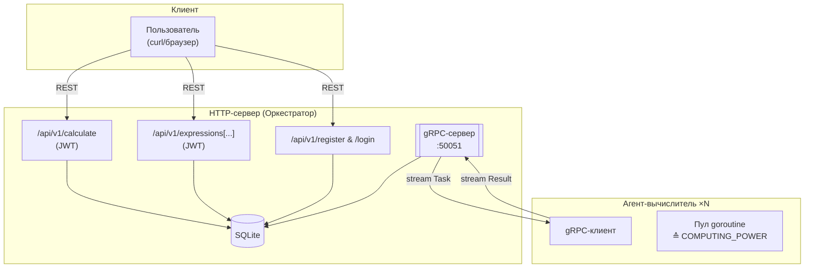

# Распределённый вычислитель арифметических выражений (финал)

Этот репозиторий — финальная версия проекта **распределённого калькулятора** для курса «Программирование на Go».
Система вычисляет арифметические выражения на разных узлах, хранит всё в SQLite и поддерживает многопользовательский режим с авторизацией по JWT.

## Содержимое

1. [Ключевые возможности](#Ключевые-возможности)
2. [Архитектура](#Архитектура)
3. [Быстрый старт](#Быстрый-старт)
4. [Конфигурация](#Конфигурация)
5. [REST API](#REST-API)
6. [Примеры cURL](#Примеры-cURL)
7. [Тестирование](#Тестирование)
8. [Полезные переменные окружения](#Полезные-переменные-окружения)

---

## Ключевые возможности

* **Многопользовательский режим** — регистрация, логин, JWT‑авторизация, изоляция данных пользователя.
* **Персистентность** — все выражения и их статусы хранятся в SQLite; при перезапуске сервиса незавершённые вычисления продолжаются.
* **GRPC‑канал** между оркестратором и агентами вместо HTTP: bidirectional‑stream ⬌ быстрый обмен задачами и результатами.
* **Модульно‑интеграционные тесты** — `go test ./...` проверяет парсер, API, авторизацию и gRPC‑взаимодействие.
* **Расширяемая конфигурация через `.env`**: порты, время операций, вычислительная мощность агента, секрет JWT и др.

---

## Архитектура



**Как это работает:**

1. Пользователь регистрируется и получает JWT‑токен через `/login`.
2. С токеном он отправляет выражение на `/calculate` → запись «pending» в БД.
3. Оркестратор разбивает выражение на задачи, кладёт их в `TasksMap`; futures хранятся в `FuturesMap`.
4. Агент через gRPC‑стрим подхватывает задачи, вычисляет и отправляет результат.
5. Когда все задачи готовы, оркестратор собирает итог, помечает выражение `completed` и записывает результат в SQLite.
6. При рестарте базы/сервера незавершённые выражения переводятся обратно в очередь.

---

1. Убедитесь, что у вас установлен Go (версии 1.24 или выше) и GCC.
* GCC: компилятор языка C, необходимый для сборки C-библиотек и зависимостей cgo. Рекомендуется версия **≥ 9.0**. Примеры установки:
    * Ubuntu/Debian: `sudo apt install build-essential`
    * Fedora: `sudo dnf install gcc`
    * macOS: `xcode-select --install`
    * Windows (TDM-GCC): самый простой способ — скачайте и установите TDM-GCC с официального сайта [https://jmeubank.github.io/tdm-gcc/](https://jmeubank.github.io/tdm-gcc/)
2. Клонируйте репозиторий:
```bash
git clone https://github.com/NeMolliriK/calculator
cd calculator
```
3. Установите зависимости:
```bash
go mod tidy
```
4. Запустите оркестратор командой:
```bash
go run cmd/orchestrator/main.go
```
5. Откройте новое окно терминала и перейдите в директорию проекта:
```bash
cd calculator
```
6. Запустите агент командой:
```bash
go run cmd/agent/main.go
```
7. По умолчанию сервис будет доступен на `http://localhost:8080`.

По умолчанию

* REST‑API: [http://localhost:8080](http://localhost:8080)
* gRPC‑сервер: `localhost:50051`

> **Нужно больше мощности?** Запустите столько агентов, сколько нужно — они автоматически подключатся к оркестратору.

---

## Конфигурация

```dotenv
# .env (пример)
PORT=8080               # HTTP‑порт оркестратора
ORCH_ADDR=localhost:50051  # адрес gRPC‑сервера для агентов

# JWT
JWT_SECRET=super-secret-string  # секрет подписи JWT

# Время выполнения (мс)
TIME_ADDITION_MS=1000
TIME_SUBTRACTION_MS=1000
TIME_MULTIPLICATIONS_MS=1000
TIME_DIVISIONS_MS=1000

# Вычислительная мощность агента
COMPUTING_POWER=10      # число параллельных горутин
```

*Все переменные имеют разумные значения по умолчанию; задавайте только то, что нужно.*

---

## REST API

> Все эндпоинты, кроме `/register` и `/login`, требуют **JWT** в заголовке
> `Authorization: Bearer &lt;token&gt;`

| Метод    | URL                        | Описание                           | Тело запроса                         | Ответ                                        |
| -------- | -------------------------- | ---------------------------------- | ------------------------------------ | -------------------------------------------- |
| **POST** | `/api/v1/register`         | Регистрация пользователя           | `{"login":"user","password":"pass"}` | `{"info":"OK"}`                              |
| **POST** | `/api/v1/login`            | Получить JWT‑токен                 | `{"login":"user","password":"pass"}` | `{"info":"OK","token":"…"}`                  |
| **POST** | `/api/v1/calculate`        | Отправить выражение на вычисление  | `{"expression":"2+2*2"}`             | `201 Created + {"id":"uuid"}`                |
| **GET**  | `/api/v1/expressions`      | Список всех выражений пользователя | —                                    | `[ {...} ]`                                  |
| **GET**  | `/api/v1/expressions/{id}` | Статус и результат по ID           | —                                    | `{"id":"…","status":"completed","result":6}` |

### Статусы выражений

* `pending` — в очереди
* `processing` — выполняется
* `completed` — готово
* `calculation error: …` — ошибка парсинга/деления на 0/скобок

---

## Примеры cURL

> **Важно:** На чистом Windows CMD используйте следующие примеры.

```bash
:: 1. Регистрация
curl -X POST http://localhost:8080/api/v1/register -H "Content-Type: application/json" -d "{\"login\":\"alice\",\"password\":\"secret\"}"

:: 2. Логин и сохранение токена в переменную
curl -X POST http://localhost:8080/api/v1/login -H "Content-Type: application/json" -d "{\"login\":\"alice\",\"password\":\"secret\"}"

:: 3. Отправка выражения
curl -X POST http://localhost:8080/api/v1/calculate -H "Authorization: Bearer <сюда впишите токен>" -H "Content-Type: application/json" -d "{\"expression\":\"(3+5)/2\"}"

:: 4. Проверить статус
curl -X GET http://localhost:8080/api/v1/expressions -H "Authorization: Bearer <сюда впишите токен>"
```

---

## Тестирование

Для запуска модульных тестов:

```bash
go test ./...
```

Для запуска интеграционных тестов:

```bash
go test ./test -tags=integration -v
```

### Логи
Четыре файла пишутся в корень проекта:
* `server_logs.txt` — HTTP‑события
* `calculations_logs.txt` — разбор выражений и расчёты
* `general_logs.txt` — общее
*  `agent_logs.txt` — логи вычислителя

При желании можно заменить логгеры на stdout, изменить уровни или интегрировать внешнюю систему.

---

Система готова к масштабированию: добавляйте новые агенты, меняйте время операций и силу вычислений.  
**Удачных вычислений!**
